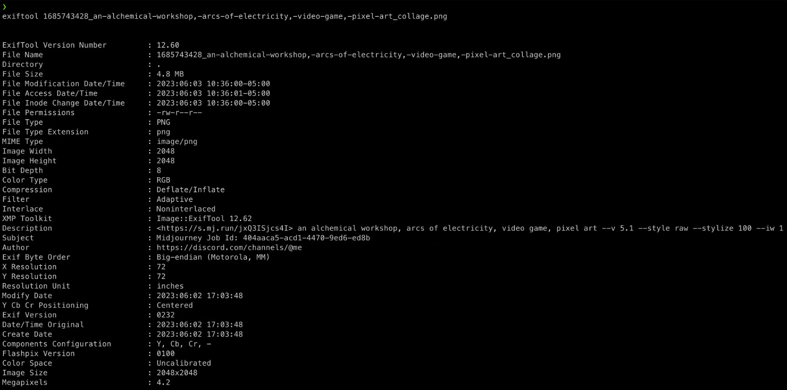
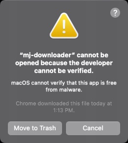
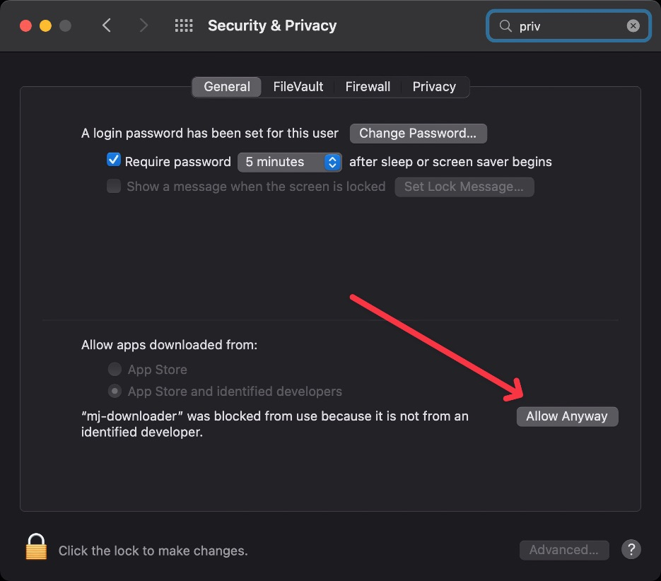

# Midjourney-Manager 

Welcome to Midjourney-Manager, a command-line application for managing and downloading all your generative images from Midjourney! Available for both Windows and Mac, this application is designed to help you keep track of your creations, download them and embed information about each image including the discord channel, the prompt used, the job ID, and more. It even downloads upscales and image collages aka the image grids for you! :framed_picture:


## :star: Features

- Download all of your images generated using Midjourney
- Track images you've already downloaded
- Embed information about each generative image
- Download upscales and image collages

## :exclamation: Limitations
Due to the way that Midjourney's current profile works, it is impossible to search past the most recent 2500 generated images. Hence, we recommend you run this script on a daily/weekly basis to always ensure your work is backed up. :hourglass_flowing_sand:

## :rocket: Getting Started


Before running the application, you'll need the following information:

- `__Secure-next-auth.session-token` (You can get this cookie from the Cookie tab in Chrome/Firefox developer console. Watch the video tutorial below for more details)

- User Id (Search for any call that says "user_id" in the Network tab. It should be in the form of GUID (e.g. `XXXXXXXX-XXXX-XXXX-XXXX-XXXXXXXXXXXX`). Copy this value.

> **Note:** Please note that the session-token should be good for several weeks. When it expires, you will receive a warning message, and will need to grab the newest one from your browser.

### Using the native CLI tool

1. Under releases, download the version suitable for your OS (Win or Mac). We recommend placing this file in the directory where you'd like to have your images downloaded to. :file_folder: Double-click to unzip the file which will be named `mj-downloader` or `mj-downloader.exe` depending on your OS.
2. You can run the CLI tool by either double-clicking on it, or by manually running the tool in a DOS prompt or terminal: `./mj-downloader` (for Mac) or `mj-downloader.exe` (for Windows).

### Using the Node CLI tool

1. Clone the repository to your local machine using `git clone https://scpedicini/midjourney-manager.git`
2. Install the dependencies using `npm install`
3. Run the tool using `npm start`

**For detailed instructions, watch this [video tutorial](#) :movie_camera:**


https://github.com/scpedicini/midjourney-manager/assets/2040540/06261501-8e3b-4040-821b-e308b459de2b


## :hammer_and_wrench: Building Yourself

If you'd like to build the project yourself, make sure you have Node v16 installed. Then use the npm scripts `mac-build` and `win-build` to create the respective bundle for Mac and Windows. Please note that due to the bundling tool used (`caxa`), it is necessary to build the respective compiled executable for Mac/Windows on the native target's OS.

## :question: FAQ

### I'm getting errors while downloading, what do I do?

Depending on how much load Midjourney's site is under, it is not uncommon to receive time outs and other types of failures while downloading images. If this happens, Midjourney-Manager will skip these images and continue on. You can re-run the tool and it will pick up where it left off and try to fetch these images again.

### Will it download the same images?

No, Midjourney-Manager tracks downloads via a file called `downloaded.json` which exists in the download directory. This means that even if you move the images to other folders, as long as you keep the `downloaded.json` file around, it won't download duplicate files.

### Where is my image information?

You can see the information embedded in an image using a dedicated tool such as [exiftool](https://exiftool.org), or via most popular image editors. If you choose to generate sidecar files, every image will have a corresponding metadata file entry with the same name ending in `.json`.



### How do I exit this dumb program?

You can exit the tool at any time by pressing `Escape` on your keyboard. This will stop the tool from downloading any more images, and will save the current state of the `downloaded.json` file.

### What are sidecar files?

Sidecar files are 1-1 files that include information related to the generation of the image. These include details such as:
- Version used (v3, v4, v5.1, niji, etc)
- Resolution
- Aspect ratio
- Prompt
- Seed
- etc

### I can't run the tool, MacOS says it's from an unidentified developer.



Unfortunately, MacOS requires that all applications be signed by an Apple Developer ID. Since the qualification process basically involves forking over money to Apple, I've chosen not to do this. As such, you have two options:

1. Open up the Security & Privacy settings and manually allow the app to run.



2. You can also run the following command in your terminal to remove the quarantine flag from the file:

```bash
xattr -d com.apple.quarantine ./mj-downloader
```

### Why aren't the images being downloaded in parallel?

Because you touch yourself at night. That's why.

## :construction_worker: Contributing

If you have any issues, suggestions or general feedback, don't hesitate to reach out or submit a pull request. Happy downloading! :sparkles: :sparkles: :sparkles:
